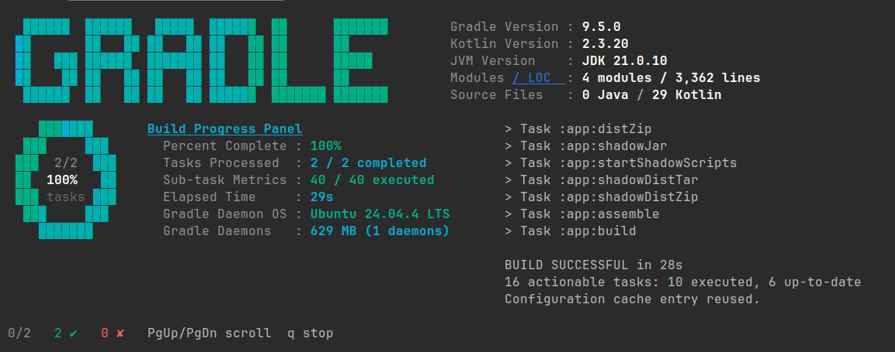

# ⚡ igradle

<p align="center">
  <a href="#-features"><b>Features</b></a> •
  <a href="#-installation"><b>Installation</b></a> •
  <a href="#-usage--controls"><b>Usage & Controls</b></a> •
  <a href="#-themes"><b>Themes & Branded Aesthetics</b></a> •
  <a href="#-architecture"><b>Architecture</b></a>
</p>

An interactive, high-performance **Gradle task launcher & real-time monitoring dashboard** built in Go. Optimized for narrow, tall terminal configurations, `igradle` provides a unified split-screen monitoring dashboard that lets you search, multi-select, and execute Gradle tasks with live streaming output and dynamic system telemetry.


https://github.com/user-attachments/assets/39603058-9e78-4765-bbb7-c05be1f618f7


---

## 📥 Installation

### 1. Homebrew (macOS & Linux)
Install `igradle` in a single command via Homebrew:
```bash
brew install I-am-Abhilash/tap/igradle
```

### 2. Direct Go Install
If you have Go installed, you can compile and install it directly from source:
```bash
go install github.com/I-am-Abhilash/igradle@latest
```

### 3. Manual Build
Clone the repository and compile:
```bash
git clone https://github.com/I-am-Abhilash/igradle.git
cd igradle
make install
```

### 4. Cross-Compile for All Platforms
Use GoReleaser to compile local packages for Linux, macOS, and Windows:
```bash
goreleaser release --snapshot --clean
```
Your compiled packages will be exported in the `./dist/` directory.

---

## 🚀 Usage & Controls

### Command Flags
```bash
igradle                       # Launch the selector (prompt for mode/failure policy)
igradle -r                    # Force-refresh the task cache
igradle -n                    # Dry run (print commands instead of executing)
igradle build test            # Run specific tasks immediately (bypasses selector)
igradle --mode parallel       # Force parallel execution mode
igradle --on-failure continue # Force continue-on-failure policy
igradle -h                    # Show CLI help
```

| Flag | Shorthand | Description |
| :--- | :--- | :--- |
| `--refresh` | `-r` | Clear and rebuild the Gradle task cache |
| `--dry-run` | `-n` | Print Gradle commands to stdout and exit |
| `--help` | `-h` | Display help menu and command options |
| `--mode` | N/A | Set execution mode (`sequential` or `parallel`) |
| `--on-failure` | N/A | Set failure behavior (`stop` or `continue`) |

---

### Key Bindings

#### 1. Selection Menu
| Key | Action |
| :--- | :--- |
| `↑` / `↓` or `j` / `k` | Navigate tasks list |
| `/` | Enter filter/search mode |
| `space` | Toggle selection checkmark |
| `enter` | Confirm selections and proceed |
| `esc` | Contextual exit (Input focus ➔ Filter reset ➔ Quit) |
| `s` | Open settings panel |
| `t` | Cycle UI color themes |

#### 2. Running & Log Viewport
| Key | Action |
| :--- | :--- |
| `Mouse Scroll` | Scroll the log viewport up or down |
| `↑` / `↓` or `j` / `k` | Scroll log by 1 line |
| `ctrl+u` / `ctrl+d` | Scroll log by 5 lines |
| `PgUp` / `PgDn` | Scroll log by half viewport |
| `q` or `ctrl+c` | Stop running (Skips remaining tasks) |

---

## 🛠️ Architecture

```
                       ┌─────────────────────────┐
                       │       Args & CLI        │
                       └────────────┬────────────┘
                                    ▼
                       ┌─────────────────────────┐
                       │    Gradle Discovery     │ (Locates gradlew)
                       └────────────┬────────────┘
                                    ▼
                       ┌─────────────────────────┐
                       │    Cache Validation     │ (.gradle/igradle_cache.txt)
                       └────────────┬────────────┘
                                    ▼
                       ┌─────────────────────────┐
                       │     Fuzzy Task List     │ (Select tasks to run)
                       └────────────┬────────────┘
                                    ▼
                       ┌─────────────────────────┐
                       │   Subprocess Spawning   │ (Parallel/Sequential)
                       └──────┬───────────┬──────┘
                              │           │
                 ┌────────────▼───┐   ┌───▼────────────┐
                 │  stdout Stream │   │  stderr Stream │
                 └────────────┬───┘   └───┬────────────┘
                              │           │
                              └─────┬─────┘
                                    ▼
                       ┌─────────────────────────┐
                       │  Thread-Safe Buffer     │ (Ring Buffer / Drop-on-Full)
                       └────────────┬────────────┘
                                    ▼
                       ┌─────────────────────────┐
                       │   Bubble Tea Renderer   │ (60Hz viewport paint)
                       └─────────────────────────┘
```

##  Features

<p align="center">
  
</p>

-  **Fuzzy Task Selector**: Fuzzy-search, filter, and multi-select tasks across all modules using a clean interactive list.
-  **Multi-Module Aware**: Automatically parses your project structure and labels tasks with their corresponding module paths.
-  **Real-Time Telemetry Dashboard**:
- **Live Elapsed Time** tracking.
- **Gradle Daemon OS Detection** (e.g. Linux, macOS, Windows).
- **Live Gradle Daemon Memory Monitoring** (RSS usage & daemon instance count).
-  **Intelligent Escape-Key Navigation**:
- *First Escape* exits filter text input, focusing the list for keyboard navigation (`j`/`k` / arrows).
- *Second Escape* resets the filter, returning the task list to its initial state.
- *Third Escape* safely exits the TUI.
-  **Auto-Scrolling Log Viewport**: Watch tasks compile, test, or publish in real time with viewport mouse-wheel support and page/half-page keyboard scrolling. Includes auto-scroll pause when reviewing logs up-viewport.
-  **Unified Brand Aesthetic**: Styled with a premium palette featuring a custom blue-to-teal gradient.
-  **Dual Execution Modes**: Choose between **Sequential** (running task by task with full logging) and **Parallel** (all tasks concurrently with multiplexed logs).
-  **Flexible Failure Policies**: Choose to stop on the first failure (providing quick Retry/Skip/Quit options) or continue executing other tasks and summarize results at the end.
-  **Smart Cache Fast-Path**: Walks up the directory tree to locate `gradlew` and caches all project tasks until a build configuration file (`build.gradle`, `build.gradle.kts`, `settings.gradle`) is modified.

---


### Subprocess Log Streaming
Logs are streamed from Gradle subprocesses asynchronously using thread-safe Ring Buffers (5000-line capacity). A drop-on-full channel buffer keeps the subprocesses from blocking on I/O. The TUI coalesces updates at 60Hz via a `tea.Tick(16ms)` loop to maintain high performance with minimal CPU utilization.

---

## 🎨 Themes & Branded Aesthetics

`igradle` uses a premium dark-themed color palette to match your workspace:
* **Brand Blue (`#209BC4`)**: Highlights panel headers, active tasks, elapsed time, and metadata.
* **Brand Teal (`#02A882`)**: Shows success statuses, completion percentages, checkmarks (`✔`), and active daemons.
* **Slate Gray (`#7F848E`)**: Keeps descriptions, inactive items, and secondary information legible without causing eye strain.

To change your theme on the fly, press `t` in the selection menu to cycle through themes (including Dracula, Nord, and Gruvbox).

---


## 📄 License

This project is licensed under the MIT License - see the `LICENSE` file for details.
